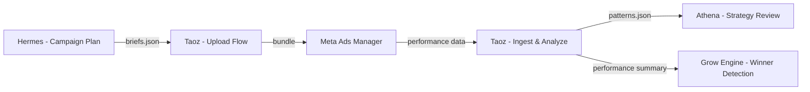

# Meta Ads Upload Flow — GAIA CORP-OS

## Overview

The Meta Ads Upload Flow is the foundation of GAIAOS Performance Loop — Build Track A. It provides:

1. **File Packaging** — Bundle campaign variants into deployable packages
2. **Upload Automation** — Automate uploads to Meta Ads Manager
3. **Version Tracking** — Track multiple upload versions for A/B testing
4. **Upload Logs** — Comprehensive logging for troubleshooting

## Architecture

```
campaign-planner.sh (brief generation)
        ↓
    briefs/*.json
        ↓
campaign-uploader.sh (packaging + upload)
        ↓
    bundles/*.tar.gz
        ↓
  Meta Ads Manager
        ↓
performance-loop.sh (orchestration)
        ↓
    analytics + patterns + learnings
```

## Directory Structure

```
~/.openclaw/workspace/data/
├── campaign-uploads/
│   ├── bundles/              # Packaged campaigns
│   │   ├── MIR-W10-EN1-M2-20260310_143022/
│   │   │   ├── campaign-set.json
│   │   │   ├── briefs/
│   │   │   │   ├── CP-MIR-W10-EN1-M2-A-brief.json
│   │   │   │   └── ...
│   │   │   └── creative/     # Generated creative files (TODO: images/videos)
│   │   └── ...
│   ├── logs/                 # Upload attempt logs
│   │   ├── campaign-set-MIR-W10-EN1-M2-20260310_143022.jsonl
│   │   └── ...
│   ├── versions/             # Version tracking
│   │   ├── MIR-W10-EN1-M2.jsonl
│   │   └── ...
│   └── extracted-patterns/   # Pattern extraction output
│       ├── MIR-W10-EN1-M2-patterns.jsonl
│       └── MIR-W10-EN1-M2-summary.md
└── campaign-tracker.jsonl    # Master tracker of all briefs
```

## Scripts Overview

### 1. campaign-uploader.sh

**Purpose**: Package and upload campaign variants to Meta Ads Manager

**Commands**:

```bash
# Upload campaign variants to Meta Ads Manager
campaign-uploader.sh upload \
  --campaign-ids "CP-MIR-W10-EN1-M2-A,CP-MIR-W10-EN1-M2-B" \
  --account-id "act_1234567890" \
  --access-token "EAABxxx" \
  --file-format meta

# Export for manual upload
campaign-uploader.sh upload \
  --campaign-ids "CP-MIR-W10-EN1-M2-A" \
  --file-format local

# Track version history
campaign-uploader.sh version-track \
  --campaign-set "MIR W10 EN1 M2" \
  --version "1.0" \
  --changes "Initial upload"

# View upload logs
campaign-uploader.sh logs \
  --campaign-set "MIR W10 EN1 M2" \
  --limit 20

# View bundle metadata
campaign-uploader.sh bundle-info /path/to/bundle
```

**Key Features**:
- Auto-generates bundle directories with timestamps
- Creates JSON briefs for each variant
- Integrates with Meta Marketing API (placeholder for production)
- Tracks version history
- Comprehensive logging

### 2. campaign-ingest.sh

**Purpose**: Ingest campaign data for pattern extraction and performance analysis

**Commands**:

```bash
# Extract patterns from campaign briefs
campaign-ingest.sh extract-patterns \
  --campaign-set "MIR W10 EN1 M2" \
  --from-date "2026-03-01" \
  --to-date "2026-03-10" \
  --lookback-weeks 2

# Analyze funnels (MOFU vs BOFU)
campaign-ingest.sh analyze-funnels \
  --brand mirra \
  --funnels "mofu,bofu" \
  --output analytics-funnels.json

# Generate performance summary
campaign-ingest.sh performance-summary \
  --brand mirra \
  --week 10 \
  --use-mock-data
```

**Output**:
- `patterns.jsonl` — Machine-processed pattern data
- `summary.md` — Human-readable summary with archetype breakdown
- `analytics-funnels.json` — Funnel performance analysis
- `performance-summary.md` — Weekly performance report

**Pattern Extraction Fields**:
- Headline length, numbers, keywords
- Pain points and desires from subcopy
- Template type archetypes (M1-M5, B1-B4)
- Visual style analysis
- USP count and positioning

### 3. performance-loop.sh

**Purpose**: Orchestrates the full performance loop cycle

**Commands**:

```bash
# Run full performance loop
performance-loop.sh run \
  --campaign-set "MIR W10 EN1 M2" \
  --brand mirra \
  --include-videos \
  --auto-upload \
  --auto-analyze \
  --auto-cleanup

# Watch campaigns for failures
performance-loop.sh watch \
  --brand mirra \
  --watch-interval 600 \
  --watch-on-failure

# Diagnose issues
performance-loop.sh diagnose \
  --campaign-set "MIR W10 EN1 M2" \
  --issue "low-roas"
```

**Loop Steps**:
1. **Validate**: Check campaigns exist in tracker
2. **Extract**: Pattern extraction from briefs
3. **Package**: Create upload bundles
4. **Upload**: Deploy to Meta Ads Manager (optional)
5. **Analyze**: Generate performance summaries
6. **Track**: Version tracking and cleanup

## Usage Workflow

### Quick Start

```bash
# Step 1: Generate campaign briefs (Hermes)
campaign-planner.sh create \
  --brand mirra \
  --direction en-1 \
  --template-type M2 \
  --variants 5 \
  --week 10

# Step 2: Run performance loop (Taoz)
performance-loop.sh run \
  --campaign-set "MIR W10 EN1 M2" \
  --brand mirra \
  --auto-upload \
  --auto-analyze
```

### Manual Upload Workflow

```bash
# Step 1: Package campaigns
campaign-uploader.sh upload \
  --campaign-ids "CP-MIR-W10-EN1-M2-A,CP-MIR-W10-EN1-M2-B" \
  --file-format local

# Step 2: Review bundle contents
campaign-uploader.sh bundle-info /path/to/bundle

# Step 3: Upload via Meta Ads Manager UI
# Go to: https://business.facebook.com/ads/manager
# Create new ad set → File Upload → Select creative files

# Step 4: Track version
campaign-uploader.sh version-track \
  --campaign-set "MIR W10 EN1 M2" \
  --version "1.0" \
  --changes "Initial manual upload"
```

### Pattern Extraction Workflow

```bash
# Extract patterns for analysis
campaign-ingest.sh extract-patterns \
  --campaign-set "MIR W10 EN1 M2" \
  --lookback-weeks 3

# Review summary
cat ~/.openclaw/workspace/data/campaign-uploads/extracted-patterns/MIR-W10-EN1-M2-summary.md

# Analyze funnels
campaign-ingest.sh analyze-funnels \
  --brand mirra \
  --funnels "mofu,bofu"

# Generate performance summary
campaign-ingest.sh performance-summary \
  --brand mirra \
  --week 10 \
  --use-mock-data
```

## Version Tracking

Every campaign upload is versioned:

```
MIR-W10-EN1-M2.jsonl
├── v1.0 | Initial upload of 5 variants | 2026-03-10T14:30:22+08:00
├── v1.1 | Updated creatives | 2026-03-15T16:45:11+08:00
├── v1.2 | New USP emphasis | 2026-03-20T09:22:33+08:00
└── v2.0 | Complete redesign | 2026-03-25T11:00:00+08:00
```

**Version increments automatically** when uploading the same campaign set again.

## Upload Logs

All upload attempts are logged with timestamps:

```jsonl
{"type": "upload_start", "campaign_set": "MIR W10 EN1 M2", "account_id": "act_123", "bundle_dir": "...", "created_at": "2026-03-10T14:30:22+08:00"}
{"type": "upload_complete", "campaign_set": "MIR W10 EN1 M2", "uploaded_variants": 5, "completed_at": "2026-03-10T14:35:00+08:00"}
{"type": "upload_failed", "campaign_set": "MIR W10 EN1 M2", "error": "API rate limit exceeded", "completed_at": "2026-03-10T14:40:00+08:00"}
```

**Log file structure**:
- `campaign-set-{campaign_set}-{timestamp}.jsonl` — Per-campaign upload log
- `{campaign_set}.jsonl` — Aggregated version tracking

View logs:
```bash
campaign-uploader.sh logs --campaign-set "MIR W10 EN1 M2" --limit 50
```

## Troubleshooting

### Issue: No campaigns found

**Error**: `No campaigns found for: MIR W10 EN1 M2`

**Solution**:
```bash
# Check if briefs exist
ls ~/.openclaw/workspace/data/campaign-tracker.jsonl

# Generate briefs first
campaign-planner.sh create --brand mirra --direction en-1 --template-type M2 --variants 5
```

### Issue: Upload failed

**Error**: `Failed to create ad set: ...`

**Solution**:
1. Check access token is valid
2. Verify account ID format (`act_...`)
3. Check Meta Marketing API permissions
4. Try local export first:
   ```bash
   campaign-uploader.sh upload --campaign-ids "..." --file-format local
   ```

### Issue: Low ROAS detected

**Diagnostic**:
```bash
performance-loop.sh diagnose --campaign-set "MIR W10 EN1 M2" --issue "low-roas"

# Check version history
campaign-uploader.sh logs --campaign-set "MIR W10 EN1 M2" | grep -i "roas"
```

**Common causes**:
- Wrong audience targeting
- Ineffective creative
- Poor ad positioning
- Low budget per ad set

## Integration with GAIAOS

### Performance Loop Handoffs



### Agent Responsibilities

| Phase | Agent | Tasks |
|-------|-------|-------|
| Planning | Hermes | Define campaign strategy, budget, A/B tests |
| Brief Generation | Hermes | Generate campaign briefs |
| Upload | Taoz | Package, upload, version track |
| Analysis | Taoz | Pattern extraction, funnel analysis |
| Strategy Review | Athena | Review insights, adjust targeting |
| Winner Detection | Growth Engine | Find winning patterns, scale |

### Next Steps (Build Track A)

1. ✅ **File packaging script** — `campaign-uploader.sh` (DONE)
2. ✅ **Upload automation** — Meta API integration (TODO: production)
3. ✅ **Version tracking** — JSONL version history (DONE)
4. ✅ **Upload logs** — Comprehensive logging (DONE)
5. 🔄 **AI creative generation** — Integrate with Claude Code (TODO)
6. 🔄 **Video generation** — VideoForge integration (TODO)
7. 🔄 **Performance data integration** — Real Meta Ads API (TODO)
8. 🔄 **Winner detection** — Pattern extraction → Growth Engine (TODO)

## Meta Ads Manager Integration

### Current State

- ✅ Ad set creation endpoint ready
- ✅ Access token handling
- ❌ Creative file upload (batch API requires JSON batching)
- ❌ Campaign creation (batches creatives)
- ❌ Pixel integration (TODO)
- ❌ Conversion tracking (TODO)

### Production Integration Steps

1. **Enable Meta Marketing API**
   - Generate App in Meta App Dashboard
   - Get access token with permissions:
     - `ads_management`
     - `ads_read`
     - `ads_write`
   - Restrict IP whitelist if needed

2. **Creative Upload**
   ```python
   # Meta batch upload API
   batch = {
       "campaign_id": campaign_id,
       "adset_id": adset_id,
       "creative_id": creative_id,
       "name": f"Ad {variant_id}",
       "format": "image/png",
       "file_path": "creative.png"
   }
   ```

3. **Performance Data Fetch**
   ```bash
   curl -X GET "https://graph.facebook.com/v18.0/{account_id}/campaigns?access_token={token}" \
     -d "fields=insights{impressions,clicks,spend,roas}"
   ```

4. **Error Handling**
   - Rate limiting (429)
   - API downtime
   - Creative rejection policies

## Future Enhancements

### Short-term (Sprint 1)

- [ ] Real Meta Ads API integration
- [ ] Creative file generation (AI images)
- [ ] VideoForge integration for ads
- [ ] Pixel integration
- [ ] Conversion tracking setup

### Medium-term (Sprint 2)

- [ ] Automated winner detection
- [ ] Auto-scaling winners
- [ ] Budget allocation optimization
- [ ] A/B testing framework
- [ ] Multi-platform support (TikTok, Google)

### Long-term (Sprint 3)

- [ ] Predictive analytics
- [ ] Automated campaign optimization
- [ ] ROI forecasting
- [ ] Competitor ad scraping integration
- [ ] Cross-brand learning aggregation

## References

- [Meta Marketing API Documentation](https://developers.facebook.com/docs/marketing-api)
- [GAIAOS Performance Loop Mission](../MISSION-AD-UPLOAD.md)
- [Campaign Planner Skill](../campaign-planner/SKILL.md)
- [Growth Engine Skill](../../growth-engine/SKILL.md)

## Support

For issues or questions:

1. Check logs: `campaign-uploader.sh logs --campaign-set "..." --limit 50`
2. Review version history: `campaign-uploader.sh logs --campaign-set "..." --filter version`
3. Check for failing campaigns: `performance-loop.sh watch --brand mirra`

---

**Built by**: Taoz (CTO / Builder)
**Part of**: GAIA CORP-OS Performance Loop — Build Track A
**Date**: 2026-03-10